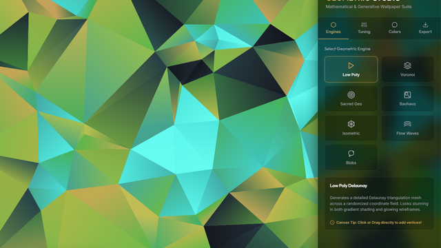
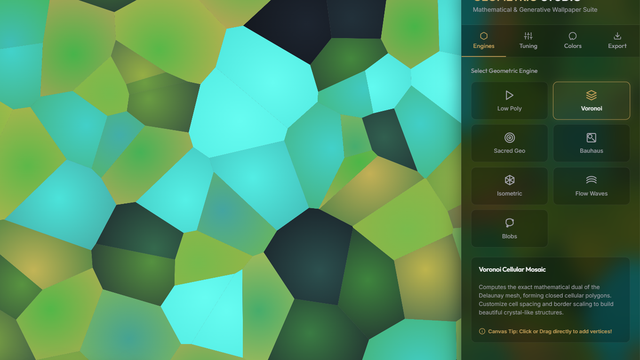
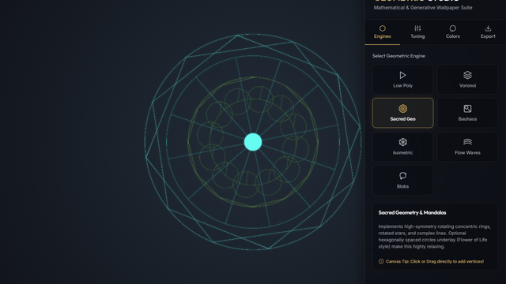
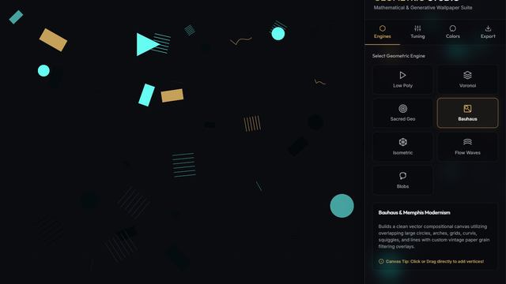
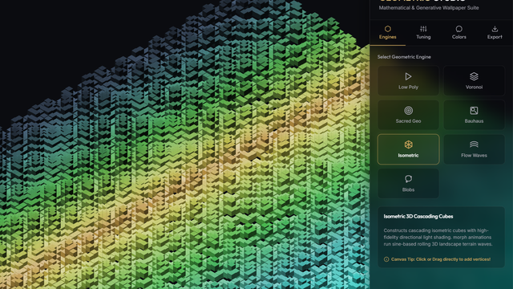
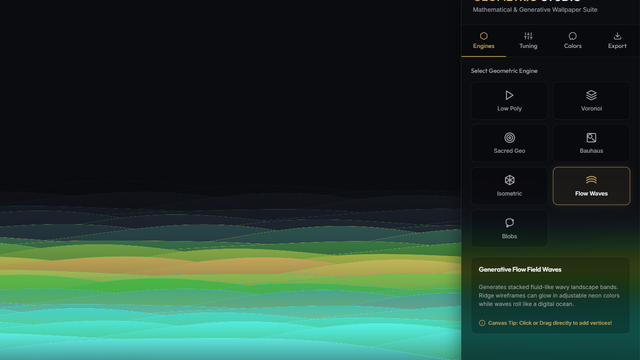
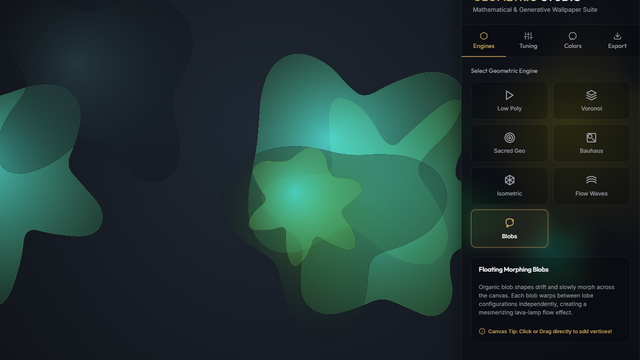

# Geometric Wallpaper Studio

A premium, fully interactive generative art engine that creates stunning mathematical wallpapers in your browser.

**Live demo:** https://radiant-cheesecake-579c52.netlify.app

## Screenshots

| Low Poly | Voronoi | Sacred Geometry | Bauhaus |
|---|---|---|---|
|  |  |  |  |

| Isometric | Flow Waves | Blobs |
|---|---|---|
|  |  |  |

## Features

- **7 Pattern Engines**: Low Poly (Delaunay), Voronoi Cells, Sacred Geometry, Bauhaus/Memphis, Isometric 3D, Flow Field Waves, Floating Morphing Blobs
- **Advanced Color System**: 10 curated palettes, HSL Color Harmony Generator, and an edit-in-place custom swatch picker
- **Interactive Canvas Sculpting**: Click to add vertices, drag to reshape meshes (mouse and touch)
- **Live Screensaver Morphing**: Organic drift animations with speed/amplitude controls, frame-rate gated for smoother performance
- **High-Res Export**: PNG up to 4K UHD (3840×2160), Scalable Vector SVG, with a busy-state indicator during heavy exports
- **Multi-Aspect Ratios**: Desktop 16:9 (4K UHD), Mobile 9:16 (QHD+), Tablet 4:3 (Retina), Square 1:1 (Hi-Res)
- **Favorites Gallery**: Save & restore designs via localStorage
- **Shareable Links**: Copy a URL that encodes the exact pattern, palette, and settings for anyone to open
- **Undo/Redo**: 30-step history stack
- **Keyboard Shortcuts**: quick pattern switching, shuffle, export, fullscreen, pause — see the in-app `?` legend
- **Accessible Controls**: pattern/ratio/palette cards and gallery actions are keyboard-operable with visible focus states
- **Interface Themes**: 4 UI chrome presets (Midnight Gold, Cyberpunk Neon, Ocean Slate, Minimal Light) — separate from the wallpaper's own color palette, persisted across sessions
- **Responsive Mobile UI**: Draggable/collapsible bottom-sheet control panel with reliable touch support

## Tech Stack

Pure HTML5 Canvas + Vanilla CSS + Vanilla JavaScript. Zero dependencies, zero build step.

| File | Purpose |
|---|---|
| `index.html` | Markup, control panel UI, aspect ratio & export presets |
| `app.js` | App state, event wiring, undo/redo, gallery, share links, keyboard shortcuts, PNG/SVG export |
| `patterns.js` | The 7 pattern-drawing engines |
| `palettes.js` | Curated color palettes + HSL harmony generator |
| `styles.css` | Layout, theming, mobile bottom-sheet styling |
| `tests.html` / `tests.js` / `test-runner.js` | Zero-dependency browser test suite (see below) |

## Usage

Try it instantly at the [live demo](https://radiant-cheesecake-579c52.netlify.app), or open `index.html` directly in any modern browser.

## Testing

Open `tests.html` directly in a browser — no Node/npm required. It runs pure-function
tests for the palette math and Delaunay/pattern engines against a mock canvas context,
plus integration tests (share-link round trip, keyboard accessibility) against the real
app loaded in a hidden iframe. Results render on the page and log to the console.

See [QA_CHECKLIST.md](QA_CHECKLIST.md) for the manual/scripted cross-browser and
mobile-viewport QA pass, including what's verified vs. what still needs real device testing.

## Deployment

Deployed on Netlify (`netlify.toml` sets security headers and long-term caching for JS/CSS). No build step is required — it deploys as a static site.

## License

MIT

## Credits

Created by [John Ngigi](https://github.com/ngigijohn) — repo: [github.com/ngigijohn/geometric-wallpapers](https://github.com/ngigijohn/geometric-wallpapers)

---

## Project Status / TODO

### Done
- [x] Core 7 pattern engines (Low Poly, Voronoi, Sacred Geometry, Bauhaus, Isometric, Flow Waves, Blobs)
- [x] 10 curated color palettes + HSL harmony generator
- [x] Interactive canvas sculpting (click/drag vertices)
- [x] Screensaver morph animation with speed/amplitude controls
- [x] PNG export (up to 4K) and SVG vector export
- [x] Aspect ratio presets (16:9, 9:16, 4:3, 1:1)
- [x] Favorites gallery with localStorage persistence
- [x] 30-step undo/redo history
- [x] Mobile responsive layout fixes (canvas visibility, bottom-sheet drag handle, collapse/expand reliability)
- [x] Netlify deployment config with security headers and asset caching, live at radiant-cheesecake-579c52.netlify.app
- [x] Optimized animations: frame-rate gated morph loop, cached Bauhaus grain tile (was a full-canvas pixel buffer every frame), cached isometric HSL color path, busy-state indicator during blocking 4K exports
- [x] Fixed touch interaction: canvas touch handlers now call `preventDefault()` so sculpting doesn't fight page scroll/zoom on mobile
- [x] Fixed mobile bottom-sheet touch bug: the drag handle's `touch-action` let the browser hijack vertical drags as a page pan, firing `pointercancel` instead of `pointerup` and silently breaking tap-to-toggle/drag-to-resize on real touch devices — fixed via `touch-action: none` plus shared cancel/release handling
- [x] Automated tests: zero-dependency browser test suite (`tests.html`) covering palette math, all 7 pattern engines, and share-link/accessibility integration tests
- [x] Cross-browser/device QA pass (Chromium desktop + emulated mobile viewport with synthetic touch/pointer events) — see `QA_CHECKLIST.md`
- [x] Shareable links via human-readable URL query params
- [x] Custom palette editor: edit any active palette's colors in place with color pickers
- [x] Keyboard shortcuts for common actions (undo/redo, shuffle, export, fullscreen, pause, pattern switching) with an in-app legend
- [x] Accessibility pass: keyboard-operable pattern/ratio/palette cards and gallery actions, ARIA roles/pressed states, visible focus styles, labeled canvas
- [x] README screenshots of each pattern engine
- [x] Fixed canvas/panel overlap: sidebar is now a real flex layout sibling (not an absolutely positioned overlay), so the wallpaper never renders — visibly blurred — underneath the glass panel
- [x] Interface theme presets (Midnight Gold, Cyberpunk Neon, Ocean Slate, Minimal Light) for the app's own UI chrome, persisted via localStorage
- [x] Verified all 12 tuning sliders (density, randomness, scale, stroke width, cell gap, symmetry, grain, glow, cube size, wave position, morph speed/amplitude) produce a measurably different render at their min/max extremes
- [x] Creator credit + GitHub link in the in-app sidebar footer and README

### Not Yet Done / Ideas
- [ ] Real iOS/Android device testing (the QA pass above uses emulated touch, which doesn't fully reproduce native mobile gesture heuristics)
- [ ] Screen reader testing (VoiceOver/TalkBack) for the newly keyboard-operable controls
- [ ] Custom domain / branded URL (currently on Netlify's default subdomain)
